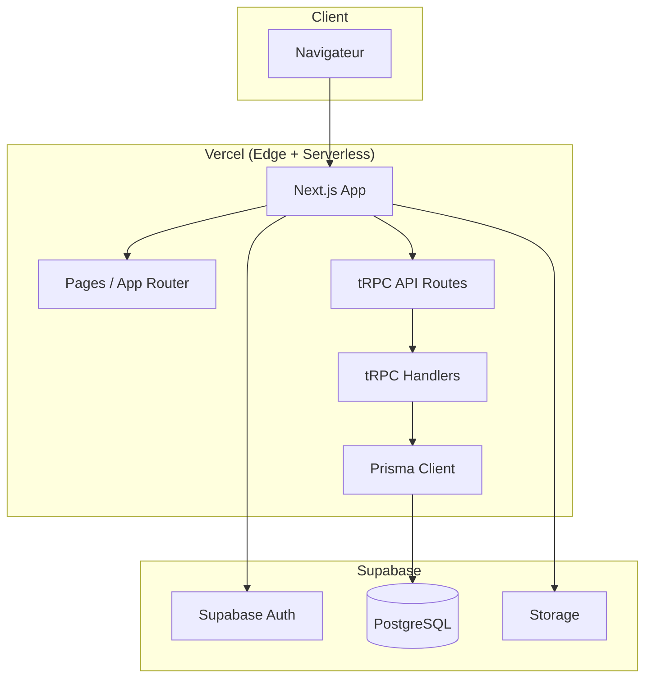

# Claritee ATS - Architecture Technique

## Introduction

Ce document décrit l'architecture technique complète du projet **Claritee ATS**, application de gestion de candidats et d'offres d'emploi pour cabinets de recrutement. Il sert de référence unique pour le développement fullstack (Next.js, tRPC, Prisma, Supabase) et couvre le multi-tenancy, la sécurité, le schéma de données et le déploiement.

**Références :**
- PRD : `docs/prd.md`
- Brief : `docs/brief.md`

### Change Log

| Date       | Version | Description                    | Author   |
|------------|---------|--------------------------------|----------|
| 2026-02-14 | 1.0     | Création architecture initiale | Architect |
| 2026-02-17 | 1.1     | Ajout principes DRY et composants partagés | - |
| 2026-02-19 | 1.2     | Ajout convention point-virgule (pas de ; si inutile) | - |
| 2026-02-21 | 1.3     | TanStack Query : staleTime 5 minutes, convention isLoading (pas isFetching) pour skeletons | - |

---

## 1. Résumé technique et contraintes

### 1.1 Style architectural

- **Style :** Monolithe fullstack (Next.js App Router + tRPC + Prisma), déployé en serverless sur Vercel.
- **Frontend :** Next.js 16 (App Router), React 19.2, TypeScript, shadcn/ui, TanStack Query.
- **Backend :** tRPC v11 dans les API Routes Next.js, Prisma comme ORM, PostgreSQL (Supabase).
- **Auth / Stockage :** Supabase Auth (JWT), Supabase Storage (fichiers).
- **Objectifs :** Budget zéro (free tiers), développeur solo, temps de chargement < 3 s, réponse API < 500 ms.

### 1.2 Contraintes cibles

| Composant    | Technologie              | Contrainte / objectif        |
|-------------|--------------------------|------------------------------|
| Runtime     | Node.js (Vercel serverless) | Free tier                 |
| Framework   | Next.js 16 App Router    | TypeScript strict            |
| API         | tRPC v11                 | Type-safe E2E                |
| ORM         | Prisma                   | Migrations versionnées       |
| DB          | Supabase PostgreSQL     | 500 Mo max                   |
| Auth        | Supabase Auth            | Sessions JWT                  |
| Storage     | Supabase Storage         | 1 Go max                     |
| Multi-tenancy | RLS Policies           | `companyId` sur tables métier |

---

## 2. Stack technique (référentiel)

| Catégorie        | Technologie    | Version cible | Rôle / justification |
|------------------|----------------|---------------|-----------------------|
| Langage          | TypeScript     | 5.9           | Typage strict front + back |
| Frontend         | React          | 19.2          | UI composants         |
| Framework        | Next.js        | 16.1.6        | App Router, SSR, déploiement Vercel |
| API              | tRPC           | 11.0          | API type-safe, partage de types |
| ORM              | Prisma         | 7.4.0         | Typage, migrations    |
| Base de données  | PostgreSQL     | 15 (Supabase) | Données relationnelles |
| Auth             | Supabase Auth  | -             | Inscription, login, JWT |
| Stockage fichiers | Supabase Storage | -          | Photos, CVs           |
| Hébergement      | Vercel         | -             | Front + API serverless |
| UI               | shadcn/ui      | -             | Composants Radix + Tailwind |
| CSS              | Tailwind CSS   | 4.1           | Styles                 |
| Validation       | Zod            | 4.3.6         | Partagé front/back     |
| State / Data     | TanStack Query | 5.59          | Cache, mutations       |
| Formulaires      | React Hook Form| 7.53          | Forms + Zod            |
| Dates            | date-fns       | 2.30          | Formatage / calculs    |
| Tests unitaires / intégration | Vitest | 2.1    | Logique + API          |
| E2E (optionnel)  | Playwright     | 1.49          | Parcours critiques     |

Détail et mise à jour des versions : voir `docs/architecture/tech-stack.md`.

---

## 3. Architecture haut niveau

### 3.1 Diagramme



### 3.2 Patterns retenus

- **Monolithe serverless :** une app Next.js (front + API tRPC), pas de microservices.
- **Multi-tenancy par ligne :** toutes les données métier sont isolées par `companyId` + RLS sur PostgreSQL.
- **API type-safe :** tRPC + Zod pour contrats partagés front/back.
- **Auth externe :** Supabase Auth gère identité et JWT ; l’app conserve un profil `User` lié à `Company`.
- **BFF implicite :** Next.js + tRPC sert de Backend-for-Frontend (pas d’API REST publique MVP).
- **DRY (Don't Repeat Yourself) :** éviter la duplication de code ; privilégier les composants partagés, hooks réutilisables et utilitaires communs. Détail : `docs/frontend-architecture.md` §4.4.

### 3.3 Conventions de code

- **Point-virgule :** ne pas mettre de `;` en fin de ligne lorsqu'il n'est pas nécessaire. En JavaScript/TypeScript, l'ASI (Automatic Semicolon Insertion) permet de s'en passer dans la plupart des cas ; privilégier un style cohérent sans point-virgule superflus.

---

## 4. Multi-tenancy et Row Level Security (RLS)

### 4.1 Principe

- **Tenant = Company (cabinet).** Chaque table métier (hors `Company`, `User`, `Invitation` gérées avec des règles dédiées) possède une colonne `companyId` (FK vers `Company`).
- **Isolation :** les politiques RLS sur Supabase garantissent qu’une requête ne voit que les lignes du cabinet de l’utilisateur connecté.

### 4.2 Règle d’accès au tenant

- L’utilisateur connecté est identifié par `auth.uid()` (Supabase).
- Le `companyId` de l’utilisateur est obtenu via la table `User` : `company_id = (SELECT company_id FROM public.user WHERE id = auth.uid())`.

### 4.3 Politiques RLS (appliquées via Prisma)

Elles sont appliquées automatiquement à chaque `prisma migrate deploy` ou `prisma migrate reset`. Aucune action manuelle dans le dashboard Supabase n’est nécessaire (voir `prisma/migrations/20300101000000_add_rls_policies/migration.sql`).

**Activation RLS sur les tables concernées :**

```sql
ALTER TABLE "Company" ENABLE ROW LEVEL SECURITY;
ALTER TABLE "User" ENABLE ROW LEVEL SECURITY;
ALTER TABLE "Invitation" ENABLE ROW LEVEL SECURITY;
ALTER TABLE "Candidate" ENABLE ROW LEVEL SECURITY;
ALTER TABLE "Tag" ENABLE ROW LEVEL SECURITY;
ALTER TABLE "ClientCompany" ENABLE ROW LEVEL SECURITY;
ALTER TABLE "JobOffer" ENABLE ROW LEVEL SECURITY;
ALTER TABLE "Note" ENABLE ROW LEVEL SECURITY;
ALTER TABLE "ShareLink" ENABLE ROW LEVEL SECURITY;
-- Tables enfants (Experience, Formation, etc.) : accès via FK vers entités déjà protégées
-- selon besoin : soit RLS sur table enfant avec companyId dérivé, soit accès uniquement via JOIN avec Candidate/JobOffer
```

**Exemple : table `Candidate` (SELECT, INSERT, UPDATE, DELETE par cabinet) :**

```sql
-- Policy: user can only see candidates of their company
CREATE POLICY "candidate_select" ON "Candidate"
  FOR SELECT USING (
    "companyId" = (SELECT "companyId" FROM "User" WHERE id = auth.uid())
  );

CREATE POLICY "candidate_insert" ON "Candidate"
  FOR INSERT WITH CHECK (
    "companyId" = (SELECT "companyId" FROM "User" WHERE id = auth.uid())
  );

CREATE POLICY "candidate_update" ON "Candidate"
  FOR UPDATE USING (
    "companyId" = (SELECT "companyId" FROM "User" WHERE id = auth.uid())
  );

CREATE POLICY "candidate_delete" ON "Candidate"
  FOR DELETE USING (
    "companyId" = (SELECT "companyId" FROM "User" WHERE id = auth.uid())
  );
```

**Table `User` :** un utilisateur ne voit que les utilisateurs de sa company :

```sql
CREATE POLICY "user_select" ON "User"
  FOR SELECT USING (
    "companyId" = (SELECT "companyId" FROM "User" WHERE id = auth.uid())
  );
-- INSERT/UPDATE : gérés par l'app (inscription, invitation) avec service role ou via API tRPC après vérification
```

**Table `Company` :** lecture pour les utilisateurs de la company ; mise à jour restreinte (ex. admin ou même company) :

```sql
CREATE POLICY "company_select" ON "Company"
  FOR SELECT USING (
    id IN (SELECT "companyId" FROM "User" WHERE id = auth.uid())
  );
```

**Tables sans `companyId` direct (ex. `Experience`, `Formation`, `Language`)**  
- Option 1 : pas de RLS sur ces tables ; l’accès est uniquement via Prisma/tRPC qui filtre toujours par `Candidate` (lui-même filtré par `companyId`).  
- Option 2 : politiques RLS basées sur une sous-requête vers `Candidate` / `JobOffer` pour vérifier le `companyId`. Pour le MVP, l’option 1 (contrôle côté app) est acceptable si toutes les requêtes passent par des procédures qui vérifient le cabinet.

**Résumé des tables avec `companyId` et RLS recommandé :**

- `Company`, `User`, `Invitation` : policies dédiées (lecture company, lecture users/invitations du cabinet).
- `Candidate`, `Tag`, `ClientCompany`, `JobOffer`, `Note`, `ShareLink` : policies SELECT/INSERT/UPDATE/DELETE sur `companyId = (SELECT "companyId" FROM "User" WHERE id = auth.uid())`.
- Tables de liaison (`CandidateTag`, `OfferTag`, `Candidature`) et tables enfants (`Experience`, `Formation`, `Language`, `ClientContact`) : soit RLS dérivé du parent, soit contrôle strict côté application.

Le fichier `docs/architecture/rls-policies.sql` reste la référence documentée ; la version exécutée est celle dans `prisma/migrations/20300101000000_add_rls_policies/migration.sql`.

---

## 5. Schéma de données (Prisma) – Vue d’ensemble

Les 16 entités du PRD sont modélisées comme suit. Le schéma Prisma complet est dans `prisma/schema.prisma`.

| Entité         | Rôle principal                          | Clé multi-tenant |
|----------------|------------------------------------------|-------------------|
| Company        | Cabinet (tenant)                         | -                 |
| User           | Utilisateur (lié à Supabase Auth par id) | companyId         |
| Invitation     | Invitation collaborateur                 | companyId         |
| Candidate      | Fiche candidat                           | companyId         |
| Experience     | Expérience pro d’un candidat            | via Candidate     |
| Formation      | Formation d’un candidat                  | via Candidate     |
| Language       | Langue d’un candidat                    | via Candidate     |
| Tag            | Tag (candidats / offres)                 | companyId         |
| CandidateTag   | Liaison candidat – tag                  | via Candidate/Tag |
| ClientCompany  | Entreprise cliente                       | companyId         |
| ClientContact  | Contact d’une entreprise cliente        | via ClientCompany |
| JobOffer       | Offre d’emploi                          | companyId         |
| OfferTag       | Liaison offre – tag                     | via JobOffer/Tag  |
| Candidature    | Association candidat – offre + statut   | via Candidate/JobOffer |
| Note           | Note (candidat ou offre)                 | companyId         |
| ShareLink      | Lien de partage fiche candidat          | via Candidate     |

Détails des champs, contraintes et relations : voir `prisma/schema.prisma` et la section 6 ci-dessous.

---

## 6. Structure du monorepo

Pas de Turborepo/Nx pour le MVP ; un seul package Next.js avec dossiers clairs et partage de types via le même projet.

```
claritee-ats/
├── .env.local                 # Ignoré ; copie de .env.example
├── .env.example               # Template variables d'environnement
├── .github/
│   └── workflows/
│       └── ci.yml            # Lint, typecheck, tests (optionnel)
├── docs/
│   ├── prd.md
│   ├── brief.md
│   ├── architecture.md       # Ce document
│   └── architecture/         # Optionnel : shards (rls-policies.sql, etc.)
├── prisma/
│   ├── schema.prisma         # Schéma complet (16 entités)
│   ├── migrations/           # Migrations versionnées
│   └── seed.ts               # Données de dev
├── public/
├── src/
│   ├── app/                  # Next.js App Router
│   │   ├── layout.tsx
│   │   ├── page.tsx          # Landing / redirect
│   │   ├── (auth)/           # Groupe : login, register, invite
│   │   │   ├── login/
│   │   │   ├── register/
│   │   │   └── invite/[token]/
│   │   ├── (dashboard)/      # Groupe : app authentifiée
│   │   │   ├── layout.tsx    # Shell + sidebar
│   │   │   ├── dashboard/
│   │   │   ├── candidates/
│   │   │   ├── offers/
│   │   │   ├── clients/
│   │   │   └── settings/
│   │   ├── share/[token]/    # Page publique (sans auth)
│   │   ├── api/
│   │   │   ├── health/       # GET /api/health
│   │   │   └── trpc/[...trpc]/  # tRPC handler
│   │   └── ...
│   ├── components/
│   │   ├── ui/               # shadcn/ui
│   │   ├── layout/           # Sidebar, header, FAB
│   │   └── ...               # Composants métier
│   ├── server/
│   │   ├── db.ts             # PrismaClient singleton
│   │   ├── trpc/
│   │   │   ├── context.ts   # Contexte tRPC (session, companyId)
│   │   │   ├── trpc.ts      # Procédure base (public, protected)
│   │   │   ├── routers/
│   │   │   │   ├── _app.ts  # Agrégation routers
│   │   │   │   ├── auth.ts
│   │   │   │   ├── company.ts
│   │   │   │   ├── candidate.ts
│   │   │   │   ├── offer.ts
│   │   │   │   ├── client.ts
│   │   │   │   ├── note.ts
│   │   │   │   └── shareLink.ts
│   │   │   └── index.ts
│   │   └── auth.ts           # Helpers Supabase Auth (server)
│   ├── lib/
│   │   ├── supabase/
│   │   │   ├── client.ts     # Client navigateur
│   │   │   └── server.ts     # Client serveur (cookies)
│   │   ├── validations/      # Schémas Zod partagés
│   │   │   ├── candidate.ts
│   │   │   ├── offer.ts
│   │   │   ├── company.ts
│   │   │   └── ...
│   │   └── utils.ts
│   ├── hooks/                # useAuth, useCompanyId, etc.
│   └── styles/
├── tests/
│   ├── unit/
│   ├── integration/         # tRPC + Prisma
│   └── e2e/                 # Playwright (optionnel)
├── package.json
├── tsconfig.json
├── next.config.js
├── tailwind.config.ts
└── README.md
```

Partage de types : les types métier viennent de Prisma (`Prisma.Candidate`, etc.) et des schémas Zod (inputs tRPC). Pas de package `shared` séparé pour le MVP.

---

## 7. Auth : Supabase Auth + tRPC + Next.js

### 7.1 Flux

1. **Inscription :** formulaire → tRPC `auth.register` → `admin.createUser` (email non confirmé) → `auth.resend({ type: 'signup', email })` (envoi email via SMTP Supabase) → création `Company` + `User` en transaction. Détail des essais et solution : [architecture/auth-email-confirmation.md](architecture/auth-email-confirmation.md).
2. **Connexion :** email/mot de passe → Supabase Auth `signInWithPassword` → session JWT (cookie ou stockage côté client selon config Supabase).
3. **Requêtes tRPC :** le contexte tRPC lit la session (Supabase `getUser` côté serveur) et résout `userId` + `companyId` (via table `User`). Les procédures `protected` exigent une session valide et injectent `companyId`.
4. **Middleware Next.js :** sur les routes `(dashboard)/**`, vérification de la session ; si absente, redirection vers `/login`. La route `/share/[token]` reste publique.

### 7.2 Contexte tRPC (résumé)

```ts
// src/server/trpc/context.ts (conceptuel)
export const createContext = async (opts: { headers: Headers }) => {
  const supabase = createServerClient(opts.headers);
  const { data: { user } } = await supabase.auth.getUser();
  const companyId = user ? await getCompanyIdFromUserId(user.id) : null;
  return { user, companyId, db: prisma };
};

// Procédure protégée : throw si !ctx.companyId
const protectedProcedure = t.procedure.use(({ ctx, next }) => {
  if (!ctx.companyId) throw new TRPCError({ code: 'UNAUTHORIZED' });
  return next({ ctx: { ...ctx, companyId: ctx.companyId } });
});
```

Toutes les mutations/queries métier (candidats, offres, clients, notes, partages) utilisent `protectedProcedure` et filtrent par `ctx.companyId`.

### 7.2.1 Session côté client (Navbar, état auth)

Pour les composants client qui doivent afficher l'état de connexion (ex. `SiteNavbar`), on utilise `getSession()` plutôt que `getUser()`. Choix documenté : `getSession()` lit la session depuis le stockage local/cookies sans appel réseau, ce qui permet un affichage immédiat au chargement. `getUser()` valide le JWT auprès du serveur et est réservé au contexte serveur (tRPC, proxy). En cas de session invalide ou expirée, `onAuthStateChange` mettra à jour l'état après le prochain refresh ou une action utilisateur.

### 7.3 Invitation

- Création d’une entrée `Invitation` (email, token, companyId, expiresAt).
- L’utilisateur ouvre `/invite/[token]` ; la page pré-remplit l’email et appelle Supabase `signUp` ; après succès, création du `User` avec `companyId` de l’invitation, puis marquage de l’invitation comme utilisée.

---

## 8. Stockage fichiers (Supabase Storage)

### 8.1 Buckets

- **`photos`** : photos candidats (JPG, PNG, WebP ; max 2 Mo). Bucket **public** ; URLs directes utilisables.
- **`cvs`** : CV (PDF, DOC, DOCX ; max 5 Mo). Bucket **privé** ; accès via URLs signées à la demande (cf. §8.5).

### 8.2 Structure par company

- Chemins recommandés :
  - Photos : `{companyId}/candidates/{candidateId}/photo.{ext}`
  - CVs : `{companyId}/candidates/{candidateId}/cv.{ext}`

Cela permet des policies Storage par `companyId` (prefix) et évite les collisions.

### 8.3 Policies Storage (concept)

- **Bucket photos** (public) : policies SELECT publiques ou par chemin selon besoin.
- **Bucket cvs** (privé) : policies SELECT restreintes (utilisateur authentifié + `companyId` dans le chemin). L'API utilise le service role pour upload/suppression ; le téléchargement passe par des URLs signées générées côté serveur.

Les policies Supabase Storage se définissent par bucket et par opération (SELECT, INSERT, DELETE) en fonction du chemin et du `company_id` de l’utilisateur (récupéré via la table `User`).

### 8.4 URLs en base

- `Candidate.photoUrl` : URL publique Supabase (après upload) ; lien direct utilisable.
- `Candidate.cvUrl` : URL de référence stockée (générée par `getPublicUrl` à l'upload). Avec un bucket privé, cette URL ne permet pas l'accès direct ; le téléchargement réel passe par les procédures d'URLs signées (§8.5).

### 8.5 Téléchargement des CVs (bucket privé)

Les CVs sont des données personnelles sensibles. L'approche retenue est un **bucket privé** avec **URLs signées** à la demande :

- **Upload / suppression** : via `uploadCv` et `deleteCv` (service role ; contourne les policies Storage).
- **Téléchargement** : au clic de l'utilisateur, l'app appelle `getCvDownloadUrl` (fiche candidat authentifiée) ou `getCvDownloadUrlByShareToken` (page partagée publique) ; la procédure génère une URL signée (durée de vie 15 min) et la retourne au client.
- **Cache client** : le hook `useCvDownloadUrl` met en cache l'URL signée 14 min pour limiter les appels répétés.
- **Contexte page partagée** : la procédure `getCvDownloadUrlByShareToken` valide le token et l'expiration du ShareLink ; rate limit 30 req/min par IP.
- **Configuration** : voir `docs/supabase-cvs-bucket-config-prompt.md` pour la création et les policies du bucket `cvs`.

---

## 9. API tRPC – Organisation des routers

- **auth** : register, login (délégation Supabase), me, logout.
- **company** : getMyCompany, updateCompany (nom ; SIREN en lecture seule).
- **invitation** : create, list, revoke, getByToken (pour page invite).
- **candidate** : list, getById, create, update, delete ; sous-routes ou procedures pour experiences, formations, languages, tags, upload photo/CV.
- **offer** : list, getById, create, update, delete ; tags ; candidatures (associer, changer statut, dissocier).
- **client** : list companies, getById, create, update, delete ; list/create/update/delete contacts.
- **note** : list (par candidateId ou offerId), create, update, delete (vérifier auteur).
- **shareLink** : create (normal/anonymous, expiration), getByToken (pour page publique), list (par candidat).

Chaque router utilise des schémas Zod (depuis `src/lib/validations/`) pour les inputs et s’appuie sur `protectedProcedure` + `ctx.companyId` pour le scope des données.

---

## 10. Sécurité et performance

### 10.1 Sécurité

- **Auth :** Supabase Auth uniquement ; pas de mot de passe en base applicative.
- **HTTPS :** imposé par Vercel/Supabase.
- **Validation :** Zod sur tous les inputs tRPC.
- **Multi-tenant :** chaque requête métier filtrée par `companyId` (+ RLS en base).
- **Messages d’erreur :** génériques côté client (ex. « Identifiants invalides ») ; détails en logs serveur.

### 10.2 Performance

- **Cible :** premier chargement < 3 s, réponse API < 500 ms (P95).
- **DB :** index sur `(companyId, createdAt)` (ou id) pour listes ; index sur `Candidate` (recherche nom, titre, résumé) si recherche full-text ou LIKE.
- **Frontend :** TanStack Query (staleTime 5 minutes par défaut, voir `docs/frontend-architecture.md` §3.1.1), lazy loading des routes, images optimisées (Next.js Image + URLs Supabase). Skeleton : utiliser `isLoading` uniquement, pas `isFetching` (évite les flashes lors de la navigation).
- **Vercel :** utiliser les régions proches du projet Supabase (ex. EU).

#### 10.2.1 Performance du serveur de développement (Turbopack)

Le serveur Next.js 16 utilise **Turbopack** par défaut en `next dev`. Il est sensible à la taille du graphe de modules chargé en mémoire. Les règles suivantes ont été établies après un incident de consommation CPU/mémoire excessive (260-350 % CPU, OOM) sur un projet de ~33 fichiers.

**Règles à respecter :**

1. **Dépendances Radix UI — packages individuels uniquement.** Ne jamais installer le package monolithique `radix-ui` (umbrella). Utiliser les packages individuels correspondant aux composants réellement utilisés (ex. `@radix-ui/react-slot`, `@radix-ui/react-label`). Le package umbrella charge l'intégralité des primitives Radix en mémoire en dev (tree-shaking limité avec Turbopack), ce qui peut provoquer des fuites mémoire et une boucle de recompilation.
2. **Prisma — pas de log `"query"` en dev.** Le logging de chaque requête SQL (`log: ["query", ...]`) accumule des strings en mémoire sur la durée d'une session dev. Utiliser `["error", "warn"]` en développement, `["error"]` en production.
3. **Cache `.next/` — nettoyer régulièrement.** En cas de comportement anormal (compilation infinie, CPU élevé au repos, OOM), supprimer le dossier `.next/` et relancer : `rm -rf .next && pnpm dev`.
4. **CSS — éviter les doublons.** Les règles `@apply` dupliquées dans `globals.css` causent du travail PostCSS inutile à chaque recompilation.
5. **tsconfig.json — ne pas modifier `"jsx"`.** Next.js 16 impose `"jsx": "react-jsx"` au démarrage. Ne pas le changer ; c'est le réglage correct pour React 19 (automatic JSX runtime).

**Diagnostic si le problème réapparaît :**

- Vérifier le FAB Next.js dans le navigateur : un « Compiling… » permanent indique une boucle de recompilation.
- Vérifier l'onglet Network du navigateur : des requêtes en boucle (polling, retry tRPC sur erreur 401) peuvent bombarder le proxy/middleware.
- En dernier recours, tester sans Turbopack : `pnpm next dev --no-turbopack`.

### 10.3 Observabilité (MVP)

Pour le MVP, pas d’outil de monitoring dédié ; on s’appuie sur les logs Vercel et un health check minimal.

**Logging**

- **Où :** sortie standard (stdout / stderr), récupérée par Vercel dans les logs de fonction et de build.
- **Quoi logger (serveur uniquement, jamais en client) :**
  - Erreurs tRPC : code (UNAUTHORIZED, NOT_FOUND, BAD_REQUEST, INTERNAL_SERVER_ERROR), message technique, et éventuellement procédure concernée ; pas de données utilisateur ni de stack en production si exposée.
  - Échecs d’auth : tentative de connexion invalide (sans détail sur le mot de passe ou l’email exact si sensible).
  - Création de lien de partage : type (normal / anonyme), `candidateId` et `companyId` si utile pour le debug ; pas d’URL complète ni de token dans les logs.
- **À ne pas logger :** mots de passe, tokens, données personnelles (email en clair en volume), corps de requête complets.
- Implémentation : `console.error` structuré (ex. objet `{ level, message, code, procedure }`) ou petit helper logger qui formate puis envoie vers stdout.

**Health check**

- **Route :** `GET /api/health` (voir `src/app/api/health/`).
- **Rôle :**
  - Vérifier qu’un déploiement répond (200 OK).
  - Optionnel : ping rapide de la DB (Prisma `$queryRaw('SELECT 1')`) pour confirmer que l’app peut joindre Supabase ; en cas d’échec, retourner 503 avec un corps explicite (ex. `{ ok: false, db: 'unavailable' }`).
- Pas d’authentification sur cette route ; pas d’informations sensibles dans la réponse. Utilisable par Vercel (Health Check) ou un monitoring externe basique.
- **Fréquence recommandée :** 10 minutes. Configurer un cron (Vercel Cron Jobs) ou un service externe (ex. UptimeRobot, cron-job.org) pour appeler `GET /api/health` toutes les 10 minutes. Cela permet de garder l’instance serverless « chaude » et de limiter les cold starts pour les utilisateurs.

### 10.4 Données personnelles et RGPD

Pour respecter le NFR9 (conformité RGPD) et les droits des personnes concernées, l’architecture prévoit les flux suivants. L’hébergement Supabase en région EU couvre la localisation des données.

**Droit d’accès et à la portabilité (export)**

- **Utilisateur (recruteur) :** possibilité d’exporter les données du compte (profil User, Company) et, au choix, l’ensemble des données du cabinet (candidats, offres, clients, notes, etc.) dans un format structuré (ex. JSON ou CSV par entité).
- **Implémentation :** procédure tRPC dédiée (ex. `settings.exportMyData`), réservée à l’utilisateur connecté, qui agrège les données scopées par `companyId` et renvoie un fichier téléchargeable ou un blob. Ne pas inclure les mots de passe (gérés par Supabase) ni les tokens de partage en clair si non nécessaire.
- **Candidat (données en base) :** les candidats sont des données métier du cabinet ; l’export « mes données » côté recruteur inclut les fiches candidats. Pour un candidat qui demanderait son propre export, traiter manuellement ou prévoir un flux dédié (hors scope MVP si non prévu au PRD).

**Droit à l’effacement (suppression)**

- **Suppression d’un candidat :** soft delete non exigé pour le MVP ; suppression en base (DELETE) avec suppression des fichiers associés (photo, CV) dans Supabase Storage. Invalider ou supprimer les `ShareLink` liés à ce candidat.
- **Suppression d’une offre, d’un client, d’une note :** DELETE en base, scopé par `companyId`. Pas de rétention obligatoire pour le MVP.
- **Suppression du compte utilisateur :** (1) suppression ou anonymisation du `User` en base, (2) désinscription ou suppression du compte côté Supabase Auth (selon API Supabase). Si le cabinet n’a plus d’utilisateur, décider si la `Company` et toutes les données du cabinet sont supprimées (effacement complet) ou conservées pour reprise ultérieure ; pour le MVP, documenter le choix (ex. « suppression en cascade du cabinet si dernier utilisateur »).
- **Suppression d’un cabinet (Company) :** supprimer toutes les données scopées par ce `companyId` (candidats, offres, clients, notes, partages, invitations, puis users, puis company) et les fichiers Storage du bucket associé. Ordre des suppressions à respecter (contraintes FK et policies).

**Rétention**

- **Données métier :** pas de purge automatique imposée pour le MVP ; les données restent tant qu’elles ne sont pas supprimées par l’utilisateur ou par le flux d’effacement ci-dessus.
- **Liens de partage :** respecter `expiresAt` ; les liens expirés ne doivent plus donner accès aux données (vérification côté `shareLink.getByToken`). Optionnel : job ou cron qui nettoie les lignes `ShareLink` expirées pour alléger la base.
- **Invitations :** après utilisation ou expiration, les lignes peuvent être conservées pour traçabilité ou supprimées ; documenter le choix (ex. « conserver 90 jours après expiration »).

**Traçabilité et responsabilité**

- Les opérations d’export et de suppression définitives peuvent être loguées (qui, quand, type d’action) en stdout pour audit, sans stocker le contenu des données exportées. Pas d’obligation de journal dédié pour le MVP si les logs Vercel suffisent.

### 10.5 Résilience

- **Timeouts :** côté client (TanStack Query, fetch tRPC), définir un timeout raisonnable (ex. 15–30 s) pour les requêtes ; au-delà, considérer la requête en échec et afficher un message utilisateur (ex. « Le serveur met trop de temps à répondre. Réessayez. »).
- **Retry :** pour les mutations (create, update, delete), pas de retry automatique par défaut (risque de doublon). Pour les queries en lecture, TanStack Query peut retenter 1–2 fois en cas d’échec réseau ; garder un délai court pour ne pas bloquer l’UI.
- **Dégradation :** si Supabase (auth ou DB) est indisponible, les pages qui en dépendent affichent un message générique (ex. « Service temporairement indisponible ») et, si possible, un bouton « Réessayer ». Ne pas exposer de détail technique à l’utilisateur. Les erreurs tRPC (INTERNAL_SERVER_ERROR, connexion DB) sont loguées côté serveur comme en §10.3.
- **Pas de circuit breaker** pour le MVP ; l’app reste stateless et chaque requête est indépendante.

### 10.6 Rate limiting

- **Objectif :** limiter les abus et rester dans les quotas des free tiers (Supabase, Vercel).
- **Périmètre recommandé (MVP) :**
  - **Auth :** limiter les tentatives de connexion / inscription par IP (ex. 10 req/min) pour limiter le brute-force et les inscriptions abusives. À implémenter dans le proxy Next.js (`src/proxy.ts`) ou via une route API dédiée qui compte en mémoire ou via un store externe (ex. Vercel KV si disponible).
  - **Génération de liens de partage :** limiter par utilisateur (ex. 20 créations/heure) pour éviter le spam.
  - **Upload (photo, CV) :** limiter par utilisateur (ex. 30 uploads/heure) ou par taille cumulée sur une fenêtre glissante.
- **Implémentation :** pour le MVP, une approche simple suffit (compteur en mémoire par IP pour l’auth en dev ; en production, envisager Vercel Edge Config, Upstash Redis, ou un package type `@upstash/ratelimit`). Si aucun rate limit n’est en place au premier déploiement, documenter la cible (seuils ci-dessus) et l’ajouter dès que possible.
- **Réponse en cas de dépassement :** HTTP 429 (Too Many Requests) ou erreur tRPC équivalente, avec message générique côté client (ex. « Trop de requêtes. Réessayez dans quelques minutes. »).

---

## 11. Guide de déploiement (Vercel + Supabase)

### 11.1 Prérequis

- Compte Vercel, compte Supabase.
- Node.js 18+ en local.

### 11.2 Supabase

1. Créer un projet Supabase (région EU pour RGPD).
2. Récupérer dans **API Keys** : l'**URL** du projet, la **Publishable key** (client) et la **Secret key** (serveur uniquement) (à n’utiliser que côté serveur, ne jamais exposer la clé secrète au client).
3. Dans Settings → Database : copier la **connection string** PostgreSQL (mode "Transaction" pour Prisma) → `DATABASE_URL`.
4. Exécuter les migrations Prisma : `npx prisma migrate deploy` (inclut automatiquement l’application des politiques RLS).
6. Créer les buckets Storage `photos` et `cvs` et configurer les policies.
7. Auth : laisser les paramètres par défaut (email/password) ; configurer l’URL de redirection (site URL + redirect URLs) vers le domaine Vercel.

### 11.3 Vercel

1. Importer le repo Git (GitHub/GitLab) dans Vercel.
2. Framework Preset : Next.js.
3. Variables d’environnement à définir :
   - `DATABASE_URL` (connection string Prisma)
   - `NEXT_PUBLIC_SUPABASE_URL`
   - `NEXT_PUBLIC_SUPABASE_PUBLISHABLE_KEY` (clé publique, ex-client)
   - `SUPABASE_SECRET_KEY` (clé secrète, serveur uniquement ; ex. opérations admin, lecture ShareLink publique)
4. Build : `npm run build` (ou `pnpm build`).
5. Déploiement : chaque push sur la branche principale peut déclencher un déploiement automatique.

### 11.4 Post-déploiement

- Vérifier `/api/health` (200 OK).
- Tester inscription → création company + user → accès dashboard.
- Tester création candidat, upload photo/CV, génération lien partage, page `/share/[token]`.

### 11.5 Limites free tier (rappel)

- Supabase : 500 Mo DB, 1 Go Storage, 50 000 MAU.
- Vercel : 100 Go bandwidth/mois, 100 GB-hrs serverless.
- Surveiller l’usage (Supabase Dashboard, Vercel Analytics) pour rester sous les seuils.

### 11.6 Backup et restauration (free tier)

En free tier, pas de backup automatique garanti par Supabase ; la responsabilité des sauvegardes incombe au projet.

- **Base de données :** utiliser les **exports manuels** depuis le dashboard Supabase (Settings → Database → Export ou outil `pg_dump` avec la connection string). Fréquence recommandée : au moins **hebdomadaire** avant des changements importants (migrations, déploiement majeur), ou après une grosse saisie. Stocker les exports dans un espace sécurisé (ex. stockage local ou cloud perso), sans les committer dans le repo.
- **Storage (photos, CV) :** Supabase ne propose pas d’export bulk simple en free tier. Pour une sauvegarde complète : lister les objets des buckets `photos` et `cvs` (API ou dashboard) et les télécharger manuellement ou via un script ponctuel. En cas de perte, les URLs en base (`Candidate.photoUrl`, `Candidate.cvUrl`) deviendront invalides ; prévoir une gestion des fichiers manquants côté UI (placeholder ou message).
- **Restauration :** réimporter un dump SQL dans un projet Supabase (nouveau ou existant) via l’éditeur SQL ou `psql`. Les migrations Prisma restent la source de vérité du schéma ; en cas de restauration sur une base vide, exécuter `prisma migrate deploy` puis importer les données du dump si besoin. Pour le code applicatif : le repo Git + déploiement Vercel suffisent ; pas de backup spécifique du code hors versioning.

Référence Supabase : [Backups and restores](https://supabase.com/docs/guides/platform/backups) (documentation officielle, selon l’offre).

### 11.7 Backup — chiffrement et audit trail (si audits)

Si le projet devient soumis à des audits (ISO 27001, SOC2, audits clients, etc.), les attentes suivantes s'appliquent :

- **Stockage des exports** : les dumps DB et fichiers exportés doivent être stockés sur un support chiffré (chiffrement at rest). Exemples : volume chiffré local, bucket cloud avec chiffrement (S3, GCS, etc.), archive compressée et chiffrée (gpg) avant stockage.
- **Traçabilité des accès sensibles** : les opérations d'export et de suppression définitive doivent être tracées (qui, quand, type d'action, identifiant concerné si pertinent). Voir §10.4 « Traçabilité et responsabilité » ; en contexte d'audit, un journal dédié (table `AuditLog` ou équivalent) peut remplacer les seuls logs stdout.
- **Périmètre** : pas d'obligation pour le MVP ; documenter ces attentes pour faciliter la montée en conformité si nécessaire.

### 11.8 Améliorations possibles

- **Recherche full-text (tsvector)** : l'implémentation actuelle utilise Prisma `OR` + `contains`/`ilike` sur les champs candidats et offres. Une variante avec **PostgreSQL tsvector** (colonnes GIN indexées, `to_tsvector`/`to_tsquery`) offrirait de meilleures performances et une pertinence renforcée sur de gros volumes, au prix d'une complexité accrue (colonnes dédiées, triggers de mise à jour, migration). Voir `docs/architecture/adr/0004-recherche-tsvector-vs-ilike.md` pour le raisonnement détaillé.

---

## 12. Fichiers de référence à créer/maintenir

- **`prisma/schema.prisma`** : schéma complet (voir fichier dédié dans le repo).
- **`docs/architecture/rls-policies.sql`** : référence documentée des policies RLS (version exécutée : `prisma/migrations/20300101000000_add_rls_policies/migration.sql`).
- **`docs/architecture/adr/`** : Architecture Decision Records (décisions clés : monolithe serverless, RLS, tRPC). Voir `adr/README.md`.
- **`docs/frontend-architecture.md`** : architecture frontend (routing, état, composants, intégration API, accessibilité). Complément à ce document pour la partie UI.
- **`docs/architecture/rate-limiting.md`** : intégration du rate limiting (seuils, où brancher). Code : `src/lib/rate-limit.ts`.
- **`.env.example`** : liste des variables (DATABASE_URL, SUPABASE_URL, Publishable key, Secret key).

---

## 13. Résumé des livrables

| Livrable              | Emplacement / contenu |
|-----------------------|-----------------------|
| Architecture document | `docs/architecture.md` (ce document) |
| Schéma Prisma complet | `prisma/schema.prisma` |
| Structure monorepo    | Section 6 ci-dessus   |
| Patterns RLS          | Section 4 + migration Prisma `20300101000000_add_rls_policies` |
| Auth flow             | Section 7             |
| Storage par company   | Section 8             |
| Observabilité (MVP)   | Section 10.3          |
| Données personnelles / RGPD | Section 10.4    |
| Résilience            | Section 10.5          |
| Rate limiting         | Section 10.6          |
| Guide déploiement     | Section 11            |
| Backup / restauration | Section 11.6          |
| Backup — chiffrement / audit (si audits) | Section 11.7 |
| ADR                   | `docs/architecture/adr/` |
| Stratégie de tests    | Section 14            |

---

## 14. Stratégie de tests

- **Périmètre (MVP) :**
  - **Unitaires (Vitest) :** logique métier pure (utils, helpers, validations Zod), et procedures tRPC avec contexte mocké (ctx avec `companyId`, `db` mock ou Prisma mock).
  - **Intégration (Vitest) :** appels tRPC réels contre une base de test (ex. SQLite en mémoire ou PostgreSQL éphémère), pour les parcours critiques (création candidat, liste scopée par company, partage). Isoler les tests (transaction rollback ou DB dédiée par test).
  - **E2E (Playwright, optionnel) :** parcours critiques uniquement : inscription → dashboard, connexion → liste candidats, création candidat, génération lien partage → ouverture page publique. Cibler Chrome ou Chromium pour le MVP.
- **Emplacements :**
  - Fichiers unitaires : `tests/unit/`, miroir du chemin source si utile (ex. `tests/unit/lib/validations/candidate.test.ts`).
  - Fichiers d’intégration : `tests/integration/` (ex. `tests/integration/trpc-candidate.test.ts`).
  - E2E : `tests/e2e/` (ex. `tests/e2e/auth.spec.ts`, `tests/e2e/candidate-share.spec.ts`).
- **Données de test :** seed dédié ou factories (ex. `tests/fixtures/`) pour créer des Company, User, Candidate de test ; ne pas dépendre du seed de dev.
- **CI :** exécuter lint + typecheck + tests unitaires et intégration sur chaque push (voir `.github/workflows/ci.yml`) ; E2E en option ou sur plan déclenché (ex. nightly, ou manuel avant release).
- **Couverture :** pas d’objectif de pourcentage imposé pour le MVP ; prioriser les chemins critiques et les cas d’erreur (validation, unauthorized, not found).
