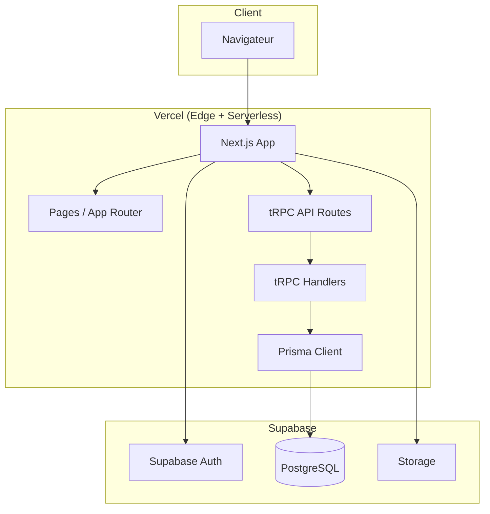

# 3. Architecture haut niveau

## 3.1 Diagramme

## 3.2 Patterns retenus

- **Monolithe serverless :** une app Next.js (front + API tRPC), pas de microservices.
- **Multi-tenancy par ligne :** toutes les données métier sont isolées par `companyId` + RLS sur PostgreSQL.
- **API type-safe :** tRPC + Zod pour contrats partagés front/back.
- **Auth externe :** Supabase Auth gère identité et JWT ; l’app conserve un profil `User` lié à `Company`.
- **BFF implicite :** Next.js + tRPC sert de Backend-for-Frontend (pas d’API REST publique MVP).
- **DRY (Don't Repeat Yourself) :** éviter la duplication de code ; privilégier les composants partagés, hooks réutilisables et utilitaires communs. Détail : `docs/frontend-architecture.md` §4.4.

## 3.3 Conventions de code

- **Point-virgule :** ne pas mettre de `;` en fin de ligne lorsqu'il n'est pas nécessaire. En JavaScript/TypeScript, l'ASI (Automatic Semicolon Insertion) permet de s'en passer dans la plupart des cas ; privilégier un style cohérent sans point-virgule superflus.

---
