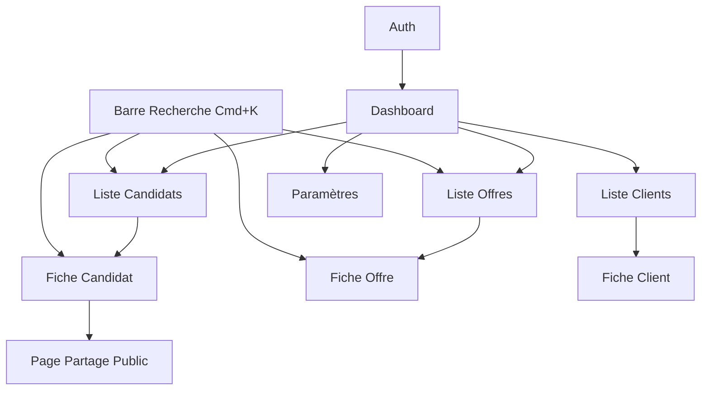

# Claritee ATS — Wireframes des écrans principaux

> Spécifications d'interface pour les 8 écrans principaux.  
> Design System de référence : `docs/design-system.md`  
> Framework UI : shadcn/ui + Tailwind CSS

---

## Architecture des écrans



---

## Layout global (shell)

Tous les écrans authentifiés partagent ce shell :

```
┌─────────────────────────────────────────────────────────────────────────┐
│  [Logo] Claritee     [Recherche Cmd+K]              [Avatar] [User ▼]   │
├──────────────┬──────────────────────────────────────────────────────────┤
│              │                                                          │
│  SIDEBAR     │  CONTENU PRINCIPAL                                       │
│              │                                                          │
│  • Dashboard │  (variable selon l'écran)                                │
│  • Candidats │                                                          │
│  • Offres    │                                                          │
│  • Clients   │                                                          │
│  • Paramètres│                                                          │
│              │                                                          │
│              │                                              [FAB +]     │
└──────────────┴──────────────────────────────────────────────────────────┘
```

- **Header** : Logo, barre de recherche globale (Cmd+K), avatar + menu utilisateur (paramètres, déconnexion)
- **Sidebar** : Navigation principale, item actif en surbrillance (secondaire)
- **FAB Notes** : Fixe bas-droite, ouvre le widget de note rapide type chat (Cmd+J, non bloquant)

---

## 1. Dashboard

### Objectif

Donner une vue d’ensemble du cabinet (métriques, actions rapides, activité récente).

### Wireframe

```
┌─────────────────────────────────────────────────────────────────────────┐
│  Dashboard                                                              │
├─────────────────────────────────────────────────────────────────────────┤
│                                                                         │
│  Bonjour, [Prénom] — Bienvenue sur votre espace                         │
│                                                                         │
│  ┌─────────────┐  ┌─────────────┐  ┌─────────────┐  ┌─────────────┐   │
│  │ Candidats   │  │ Offres      │  │ Clients     │  │ Partagés    │   │
│  │    42       │  │ actives 12  │  │    8        │  │ ce mois 5   │   │
│  │ [Voir →]    │  │ [Voir →]    │  │ [Voir →]    │  │             │   │
│  └─────────────┘  └─────────────┘  └─────────────┘  └─────────────┘   │
│                                                                         │
│  Actions rapides                                                        │
│  [Nouveau candidat]  [Nouvelle offre]  [Nouveau client]                 │
│  (terracotta)        (outline)         (outline)                        │
│                                                                         │
│  ┌──────────────────────────────┐  ┌──────────────────────────────┐   │
│  │ Candidats récents             │  │ Notes récentes                │   │
│  │ • Marie D. — Designer UX      │  │ • "Rappeler demain" — Marie   │   │
│  │ • Thomas L. — Dev Backend     │  │ • "Validé par le client"      │   │
│  │ • ...                         │  │ • ...                         │   │
│  │ [Voir tous →]                 │  │ [Voir tout →]                 │   │
│  └──────────────────────────────┘  └──────────────────────────────┘   │
│                                                                         │
└─────────────────────────────────────────────────────────────────────────┘
```

### Éléments clés

| Élément | Spécification |
|---------|----------------|
| Métriques | 4 cards, fond `#FDFCFA`, bordure légère |
| CTA principal | "Nouveau candidat" en terracotta |
| CTA secondaires | Outline |
| Candidats récents | 5 derniers, nom + titre, lien vers fiche |
| Notes récentes | 5 dernières, extrait + auteur, lien vers contexte |
| Empty state | Message invitant à ajouter des données |

---

## 2. Liste Candidats

### Objectif

Parcourir, filtrer et accéder rapidement aux fiches candidats.

### Wireframe

```
┌─────────────────────────────────────────────────────────────────────────┐
│  Candidats                                            [Nouveau candidat]│
├─────────────────────────────────────────────────────────────────────────┤
│                                                                         │
│  [Recherche...]  [Tags ▼]  [Ville ▼]  [Effacer filtres]   42 candidats │
│                                                                         │
│  ┌──────────────────────────────────────────────────────────────────┐  │
│  │ [Photo] Marie Dupont                    Designer UX · Paris       │  │
│  │         [tag: dev] [tag: React]                         [→]      │  │
│  ├──────────────────────────────────────────────────────────────────┤  │
│  │ [Photo] Thomas Leroy                   Dev Backend · Lyon         │  │
│  │         [tag: backend] [tag: Java]                      [→]      │  │
│  ├──────────────────────────────────────────────────────────────────┤  │
│  │ [Photo] Sophie Martin                  Product Manager · Bdx      │  │
│  │         [tag: PM] [tag: agile]                         [→]      │  │
│  └──────────────────────────────────────────────────────────────────┘  │
│                                                                         │
│  [< Précédent]  Page 1 sur 3  [Suivant >]                              │
│                                                                         │
└─────────────────────────────────────────────────────────────────────────┘
```

### Éléments clés

| Élément | Spécification |
|---------|----------------|
| Barre de recherche | Pleine largeur, debounce 300ms |
| Filtres | Tags (multi-select), Ville (autocomplete) |
| Chips actifs | Affichés au-dessus de la liste, X pour retirer |
| Carte candidat | Photo (ou initiales), nom, titre, ville, max 3 tags |
| Clic sur la ligne | Navigation vers fiche candidat |
| Pagination | 20 éléments par page |
| Empty state | Illustration + "Ajouter un candidat" |

---

## 3. Fiche Candidat (layout CV)

### Objectif

Afficher le profil candidat dans un format CV professionnel (header + 2 colonnes).

### Wireframe

```
┌─────────────────────────────────────────────────────────────────────────┐
│  [← Retour]                              [Modifier] [Partager] [Suppr.] │
├─────────────────────────────────────────────────────────────────────────┤
│                                                                         │
│  ┌────────────────────────── HEADER ─────────────────────────────────┐ │
│  │  [Photo 80px]   Marie Dupont                                      │ │
│  │    circulaire   Designer UX · Paris                               │ │
│  │                 ✉ marie@mail.com  📞 06...  🔗 LinkedIn           │ │
│  └───────────────────────────────────────────────────────────────────┘ │
│                                                                         │
│  ┌── COLONNE GAUCHE (30%) ──┐  ┌── COLONNE DROITE (70%) ─────────────┐│
│  │ Résumé                   │  │ Expériences professionnelles        ││
│  │ Lorem ipsum...           │  │ ┌─────────────────────────────────┐ ││
│  │ (500 chars max)          │  │ │ 2022 - Aujourd'hui              │ ││
│  │                          │  │ │ Designer UX · TechCorp          │ ││
│  │ Tags                     │  │ │ Description...                  │ ││
│  │ [dev] [React] [PM]       │  │ └─────────────────────────────────┘ ││
│  │ [+ Ajouter]              │  │ [+ Ajouter une expérience]          ││
│  │                          │  │                                     ││
│  │ Langues                  │  │ Formations                          ││
│  │ [FR Natif] [EN Bilingue] │  │ ┌─────────────────────────────────┐ ││
│  │                          │  │ │ 2018 - 2021                     │ ││
│  │ [CV: doc.pdf 📥]         │  │ │ Master Design · École XYZ       │ ││
│  └──────────────────────────┘  │ └─────────────────────────────────┘ ││
│                                │ [+ Ajouter une formation]            ││
│                                └─────────────────────────────────────┘│
│                                                                         │
│  ┌── OFFRES ASSOCIÉES ────────────────────────────────────────────────┐│
│  │ Dev React @ ClientA — [Postulé]  |  PM @ ClientB — [Contacté]     ││
│  └───────────────────────────────────────────────────────────────────┘│
│                                                                         │
│  ┌── NOTES ───────────────────────────────────────────────────────────┐│
│  │ [+ Ajouter une note]                                               ││
│  │ • Jean D. — 12/02 — "Rappeler demain pour feedback"                ││
│  │ • Marie D. — 10/02 — "Très bon premier échange"                    ││
│  └───────────────────────────────────────────────────────────────────┘│
│                                                                         │
└─────────────────────────────────────────────────────────────────────────┘
```

### Éléments clés

| Élément | Spécification |
|---------|---------------|
| Header | Photo 80x80, nom, titre, ville, contacts |
| Colonne gauche | Langues (badges), Tags (badges + ajout), Résumé, lien CV |
| Colonne droite | Expériences, formations (ordre chrono inversé) |
| Offres | Badges de statut, liens vers fiches offre |
| Notes | Liste chrono inversée, auteur + date + contenu |
| Actions | Modifier (outline), Partager (outline), Supprimer (destructive) |

---

## 4. Liste Offres

### Objectif

Voir et filtrer les offres d’emploi, accéder à la fiche offre.

### Wireframe

```
┌─────────────────────────────────────────────────────────────────────────┐
│  Offres                                                [Nouvelle offre] │
├─────────────────────────────────────────────────────────────────────────┤
│                                                                         │
│  [Recherche...]  [Statut ▼]  [Tags ▼]  [Salaire]  [Client ▼]  [Effacer]│
│                                                                         │
│  ┌──────────────────────────────────────────────────────────────────┐  │
│  │ Dev React Senior                    ClientA · Paris · 50-60k€    │  │
│  │ [En cours] [tag: tech] [tag: front]                    [→]       │  │
│  ├──────────────────────────────────────────────────────────────────┤  │
│  │ Product Manager B2B                 ClientB · Lyon · 55-65k€     │  │
│  │ [À faire] [tag: PM]                                  [→]        │  │
│  ├──────────────────────────────────────────────────────────────────┤  │
│  │ Architecte Cloud                    ClientA · Remote · 70-80k€   │  │
│  │ [Terminé] [tag: cloud] [tag: AWS]                     [→]       │  │
│  └──────────────────────────────────────────────────────────────────┘  │
│                                                                         │
│  [< Précédent]  Page 1 sur 2  [Suivant >]                              │
│                                                                         │
└─────────────────────────────────────────────────────────────────────────┘
```

### Éléments clés

| Élément | Spécification |
|---------|---------------|
| Statuts | Badges colorés (À faire, En cours, Terminé) |
| Filtres | Statut, Tags, Salaire min/max, Client, Ville |
| Carte offre | Titre, client, localisation, fourchette salaire, tags |
| Clic | Navigation vers fiche offre |

---

## 5. Fiche Offre

### Objectif

Voir les détails d’une offre, le client associé et les candidats liés avec leurs statuts.

### Wireframe

```
┌─────────────────────────────────────────────────────────────────────────┐
│  [← Retour]                                         [Modifier] [Suppr.] │
├─────────────────────────────────────────────────────────────────────────┤
│                                                                         │
│  Dev React Senior                                        [En cours]    │
│  ClientA · Paris · 50 000€ - 60 000€                                   │
│  [tag: tech] [tag: front] [tag: React]                                 │
│                                                                         │
│  Description                                                            │
│  ┌──────────────────────────────────────────────────────────────────┐  │
│  │ Nous recherchons un développeur React senior pour...              │  │
│  └──────────────────────────────────────────────────────────────────┘  │
│                                                                         │
│  Candidats associés                                    [Associer]      │
│  ┌──────────────────────────────────────────────────────────────────┐  │
│  │ [Photo] Marie D.  Designer UX   [Postulé ▼]        [Dissocier]   │  │
│  │ [Photo] Thomas L. Dev Backend   [Contacté ▼]       [Dissocier]   │  │
│  │ Aucun candidat associé (si vide)                                  │  │
│  └──────────────────────────────────────────────────────────────────┘  │
│                                                                         │
│  Notes                                                                  │
│  ┌──────────────────────────────────────────────────────────────────┐  │
│  │ [+ Ajouter une note]                                              │  │
│  │ • Jean D. — 14/02 — "Client veut voir 3 profils supplémentaires"  │  │
│  └──────────────────────────────────────────────────────────────────┘  │
│                                                                         │
└─────────────────────────────────────────────────────────────────────────┘
```

### Éléments clés

| Élément | Spécification |
|---------|---------------|
| Header | Titre, client, localisation, fourchette salaire, statut, tags |
| Description | Zone texte, scroll si long |
| Candidats | Photo, nom, titre, dropdown de statut, bouton dissocier |
| Statuts | 6 valeurs (Contacté LinkedIn, Contact téléphonique, etc.) |
| Notes | Même pattern que fiche candidat |

---

## 6. Liste Clients

### Objectif

Lister les entreprises clientes, nombre de contacts et d’offres.

### Wireframe

```
┌─────────────────────────────────────────────────────────────────────────┐
│  Clients                                              [Nouveau client]  │
├─────────────────────────────────────────────────────────────────────────┤
│                                                                         │
│  [Recherche...]                                                         │
│                                                                         │
│  ┌──────────────────────────────────────────────────────────────────┐  │
│  │ ClientA                                        SIREN 123 456 789  │  │
│  │ 3 contacts · 2 offres actives                          [→]        │  │
│  ├──────────────────────────────────────────────────────────────────┤  │
│  │ ClientB                                        SIREN 987 654 321  │  │
│  │ 1 contact · 1 offre active                            [→]        │  │
│  └──────────────────────────────────────────────────────────────────┘  │
│                                                                         │
└─────────────────────────────────────────────────────────────────────────┘
```

### Éléments clés

| Élément | Spécification |
|---------|---------------|
| Carte client | Raison sociale, SIREN, compteurs contacts/offres |
| Clic | Vers fiche client (contacts, offres associées) |

---

## 7. Fiche Client

### Objectif

Afficher les informations complètes d’une entreprise cliente, gérer ses contacts et voir les offres associées.

### Wireframe

```
┌─────────────────────────────────────────────────────────────────────────┐
│  [← Retour]                                      [Modifier] [Suppr.]   │
├─────────────────────────────────────────────────────────────────────────┤
│                                                                         │
│  ClientA                                                                │
│  SIREN 123 456 789                                                     │
│                                                                         │
│  ┌── Informations ────────────────────────────────────────────────────┐│
│  │  Raison sociale  ClientA SAS                                       ││
│  │  SIREN           123 456 789                                       ││
│  └────────────────────────────────────────────────────────────────────┘│
│                                                                         │
│  ┌── Contacts                              [+ Ajouter un contact] ─────┐│
│  │                                                                     ││
│  │  ┌─────────────────────────────────────────────────────────────┐   ││
│  │  │ Jean Martin                    Directeur RH                 │   ││
│  │  │ ✉ jean.martin@clienta.fr  [📋]   📞 06 12 34 56 78  [📋]   │   ││
│  │  │ 🔗 LinkedIn                         [Modifier] [Supprimer]   │   ││
│  │  └─────────────────────────────────────────────────────────────┘   ││
│  │  ┌─────────────────────────────────────────────────────────────┐   ││
│  │  │ Sophie Bernard               Responsable Recrutement        │   ││
│  │  │ ✉ s.bernard@clienta.fr  [📋]   📞 06 98 76 54 32  [📋]     │   ││
│  │  │ 🔗 LinkedIn                         [Modifier] [Supprimer]   │   ││
│  │  └─────────────────────────────────────────────────────────────┘   ││
│  │                                                                     ││
│  │  Aucun contact ajouté (si vide)                                    ││
│  └─────────────────────────────────────────────────────────────────────┘│
│                                                                         │
│  ┌── Offres associées ────────────────────────────────────────────────┐│
│  │  Dev React Senior — [En cours]  ·  Paris  ·  50-60k€      [→]     ││
│  │  Product Manager  — [À faire]   ·  Lyon   ·  55-65k€      [→]     ││
│  │  Aucune offre associée (si vide)                                   ││
│  └────────────────────────────────────────────────────────────────────┘│
│                                                                         │
└─────────────────────────────────────────────────────────────────────────┘
```

### Modal Ajouter / Modifier un contact

```
┌─────────────────────────────────────────┐
│  Ajouter un contact              [X]   │
├─────────────────────────────────────────┤
│  Prénom *    [________________]         │
│  Nom *       [________________]         │
│  Email       [________________]         │
│  Téléphone   [________________]         │
│  Poste       [________________]         │
│  LinkedIn    [________________]         │
│                                         │
│  [Annuler]              [Enregistrer]   │
└─────────────────────────────────────────┘
```

### Éléments clés

| Élément | Spécification |
|---------|---------------|
| **Header client** | Raison sociale, SIREN |
| **Actions** | Modifier (infos cabinet), Supprimer (avec confirmation) |
| **Contacts** | Carte par contact : nom, poste, email, tél, LinkedIn |
| **Ajouter un contact** | CTA outline/secondaire, ouvre modal avec formulaire |
| **Modifier / Supprimer** | Sur chaque contact, suppression avec confirmation |
| **Copier** | Icône 📋 à côté de l’email et du tél → copie dans le presse-papiers + toast |
| **Offres associées** | Liste des offres liées au client, lien vers fiche offre |
| **Empty states** | « Aucun contact ajouté » et « Aucune offre associée » |

### Champs contact (PRD Story 3.2)

| Champ | Obligatoire | Validation |
|-------|-------------|------------|
| Prénom | Oui | — |
| Nom | Oui | — |
| Email | Non | Format email si renseigné |
| Téléphone | Non | — |
| Poste | Non | — |
| LinkedIn | Non | Format linkedin.com/in/... si renseigné |

---

## 8. Page Partage Public (fiche candidat)

### Objectif

Afficher une fiche candidat partagée sans authentification (normale ou anonymisée).

### Wireframe (version normale)

```
┌─────────────────────────────────────────────────────────────────────────┐
│  [Logo Claritee / Cabinet]                    Propulsé par Claritee     │
├─────────────────────────────────────────────────────────────────────────┤
│                                                                         │
│  Même layout CV que la fiche candidat interne :                         │
│  • Header (photo, nom, titre, ville, contacts)                          │
│  • 2 colonnes (langues, tags*, résumé | expériences, formations)        │
│                                                                         │
│  * Tags : selon configuration partage                                   │
│                                                                         │
│  Masqué : notes, offres associées, données internes                     │
│                                                                         │
└─────────────────────────────────────────────────────────────────────────┘
```

### Wireframe (version anonymisée)

```
┌─────────────────────────────────────────────────────────────────────────┐
│  [Logo Claritee / Cabinet]     [Fiche anonymisée]  Propulsé par Claritee│
├─────────────────────────────────────────────────────────────────────────┤
│                                                                         │
│  [Avatar générique]  Candidat anonyme                                   │
│                      Designer UX · Paris                                │
│                      (pas d'email, tél, LinkedIn)                       │
│                                                                         │
│  Expériences : "[Entreprise confidentielle]" à la place des noms        │
│  Formations : "[École confidentielle]"                                  │
│                                                                         │
│  ┌──────────────────────────────────────────────────────────────────┐  │
│  │ Intéressé par ce profil ? Contactez [Nom du cabinet]              │  │
│  │ [Bouton CTA : Contacter]                                          │  │
│  └──────────────────────────────────────────────────────────────────┘  │
│                                                                         │
└─────────────────────────────────────────────────────────────────────────┘
```

### Éléments clés

| Élément | Spécification |
|---------|---------------|
| Branding | Logo cabinet / Claritee en header |
| Version anonyme | Badge "Fiche anonymisée", CTA contact |
| Pas de navigation | Page standalone, pas de sidebar |
| Erreur | Message clair si lien expiré/invalide |

---

## 9. Paramètres (Gestion Cabinet)

### Objectif

Gérer les infos du cabinet, l’équipe et les invitations.

### Wireframe

```
┌─────────────────────────────────────────────────────────────────────────┐
│  Paramètres                                                             │
├─────────────────────────────────────────────────────────────────────────┤
│                                                                         │
│  ┌── Informations du cabinet ──────────────────────────────────────┐   │
│  │  Raison sociale  [________________]                             │   │
│  │  SIREN           [123 456 789] (lecture seule)                  │   │
│  │  [Enregistrer]                                                  │   │
│  └─────────────────────────────────────────────────────────────────┘   │
│                                                                         │
│  ┌── Équipe ───────────────────────────────────────────────────────┐   │
│  │  Marie Dupont    marie@cabinet.fr      Membre depuis 01/2025     │   │
│  │  Thomas Leroy    thomas@cabinet.fr     Membre depuis 02/2025     │   │
│  │  (vous)                                                         │   │
│  └─────────────────────────────────────────────────────────────────┘   │
│                                                                         │
│  ┌── Invitations en attente ───────────────────────────────────────┐   │
│  │  sophie@cabinet.fr   Expire le 21/02  [Copier lien] [Révoquer]   │   │
│  │  [Inviter un collaborateur]                                      │   │
│  └─────────────────────────────────────────────────────────────────┘   │
│                                                                         │
│  ┌── Mon profil ───────────────────────────────────────────────────┐   │
│  │  Prénom  [________________]  Nom  [________________]             │   │
│  │  Email   [________________]                                      │   │
│  │  [Changer le mot de passe]  [Enregistrer]                        │   │
│  └─────────────────────────────────────────────────────────────────┘   │
│                                                                         │
└─────────────────────────────────────────────────────────────────────────┘
```

### Éléments clés

| Élément | Spécification |
|---------|---------------|
| Cabinet | Raison sociale éditable, SIREN en lecture seule |
| Équipe | Liste membres (nom, email, date) |
| Invitations | Liste en attente, copie lien, révocation |
| Profil | Prénom, nom, email, changement mot de passe |

---

## Modals & composants récurrents

### Widget Note rapide (FAB / Cmd+J)

Panneau flottant type chat (non bloquant, navigation possible) :
- Header : titre, menu "Mes notes" (liste déroulante), bouton fermer
- Liste des notes (au-dessus de la saisie) : tri par dernière modification
- Zone saisie : éditeur BlockNote
- Auto-save (debounce 2 s)

### Modal Partager (depuis fiche candidat)

```
┌─────────────────────────────────────────┐
│  Partager la fiche candidat       [X]   │
├─────────────────────────────────────────┤
│  ○ Fiche complète                       │
│  ○ Fiche anonymisée                     │
│                                         │
│  Expiration [7 jours ▼]                 │
│                                         │
│  Lien généré :                          │
│  [https://.../share/xxx    ] [Copier]   │
│                                         │
│  [Fermer]                               │
└─────────────────────────────────────────┘
```

### Barre de recherche (Cmd+K)

```
┌─────────────────────────────────────────────────────────┐
│  🔍 Rechercher candidats, offres...                     │
├─────────────────────────────────────────────────────────┤
│  CANDIDATS                                              │
│  • Marie Dupont — Designer UX                           │
│  • Thomas Leroy — Dev Backend                           │
│  OFFRES                                                 │
│  • Dev React Senior — ClientA                           │
│  ─────────────────────────────────────────────────────  │
│  Voir tous les résultats pour "marie"                   │
└─────────────────────────────────────────────────────────┘
```

---

## Changelog

| Date | Version | Description | Auteur |
|------|---------|-------------|--------|
| 2026-02-14 | 1.0 | Création des wireframes des 8 écrans | Sally (UX Expert) |
